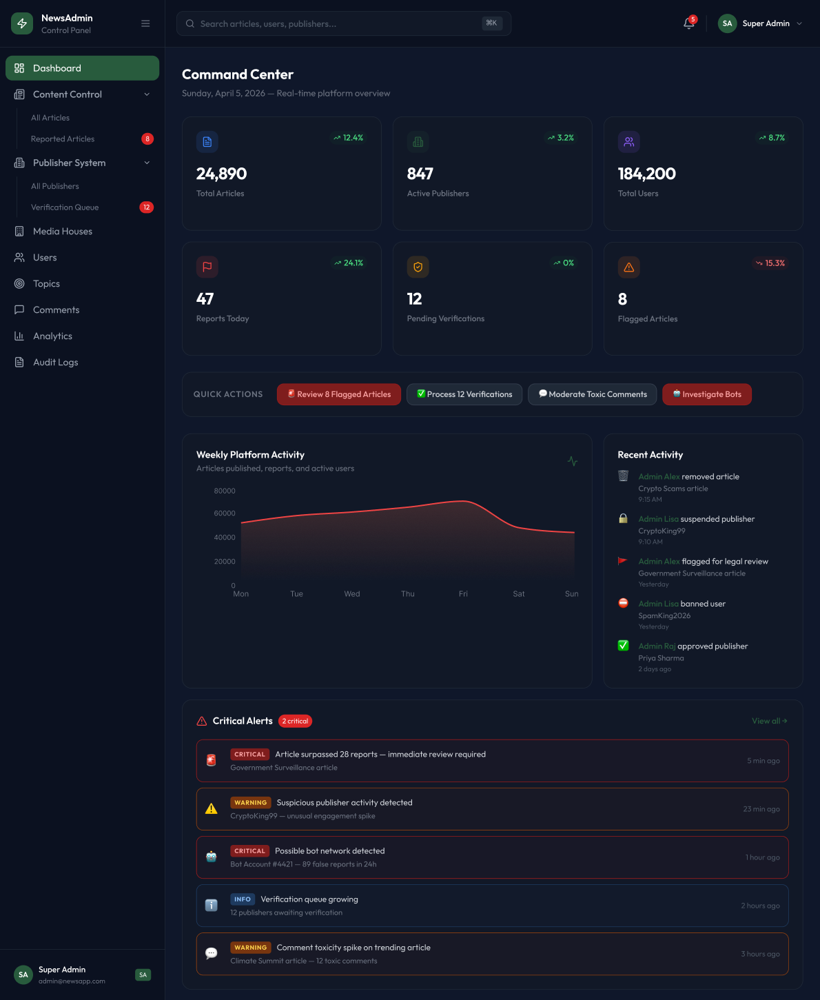

# NewsAdmin — Samāchāra Platform 📰

A full-featured admin dashboard panel for managing a comprehensive news publishing platform. Built with React, Vite, and Tailwind CSS.

**[🎨 View Figma Design](https://www.figma.com/design/FuZNFI5aEPTzzN73uggEq6/News-Agreggator)**

---

## ✨ Features

- **Executive Dashboard:** KPI cards tracking total articles, active publishers, and reports with beautiful Recharts data visualization.
- **Content Moderation:** Comprehensive article management with reporting queues and AI summary integration.
- **Publisher Verification:** Specialized queue for reviewing publisher applications with integrated document viewer (Govt ID, Press Card).
- **User & Media House Management:** Suspend, block, or approve users and organizations securely.
- **Dark Mode UX:** A stunning, premium dark-theme UI designed for extended administration sessions.

---

## 🛠️ Tech Stack

- **Framework:** React 19 + Vite
- **Routing:** React Router DOM
- **Styling:** Tailwind CSS + PostCSS
- **Data Visualization:** Recharts
- **Icons:** Lucide React
- **Deployment:** Docker (multi-stage Node + Nginx)

---

## ⚙️ Setup & Installation

### Prerequisites
- Node.js (v18+)

### Running Locally

1. **Clone the repo:**
   ```bash
   git clone https://github.com/raydennnnn/news-admin-panel.git
   cd news-admin-panel
   ```

2. **Install dependencies:**
   ```bash
   npm install
   ```

3. **Environment Setup:**
   Create a `.env` file in the root with your API backend URL:
   ```env
   VITE_API_BASE_URL=http://localhost:5000/api
   ```

4. **Start the development server:**
   ```bash
   npm run dev
   ```

### Docker Deployment

A production-ready `Dockerfile` and `nginx.conf` are included.

```bash
docker build -t news-admin-panel .
docker run -p 80:80 news-admin-panel
```

---

## 📸 Screenshots

<p align="center">
  
</p>
<p align="center">
  
</p>
<p align="center">
  
</p>
<p align="center">
  
</p>
